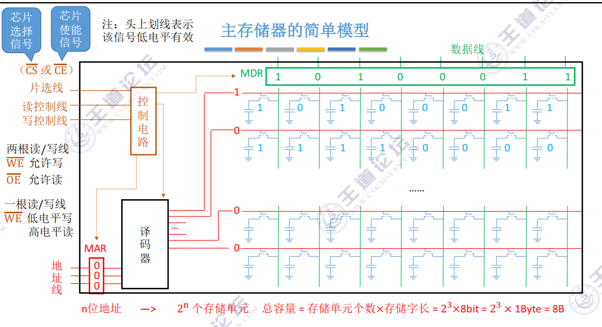
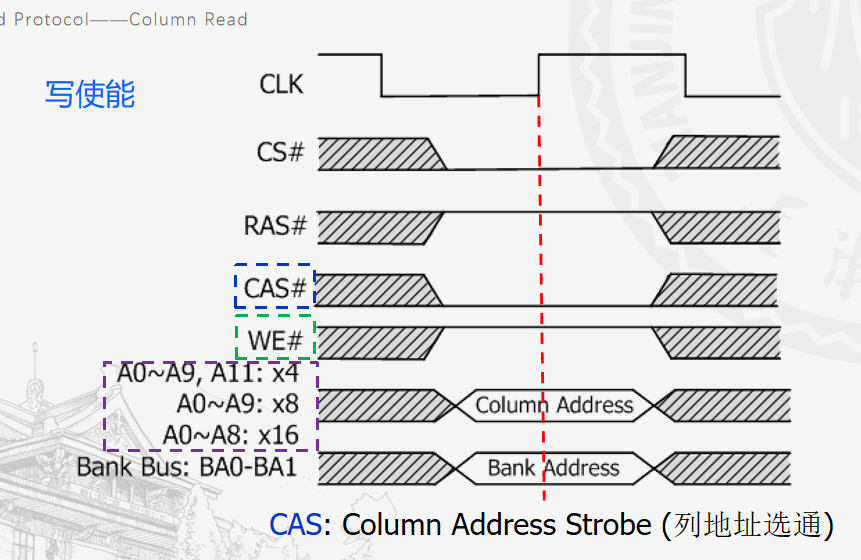
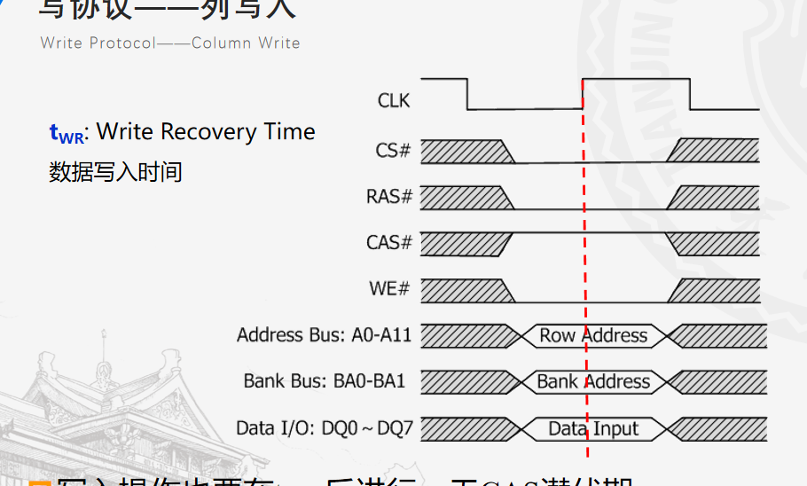
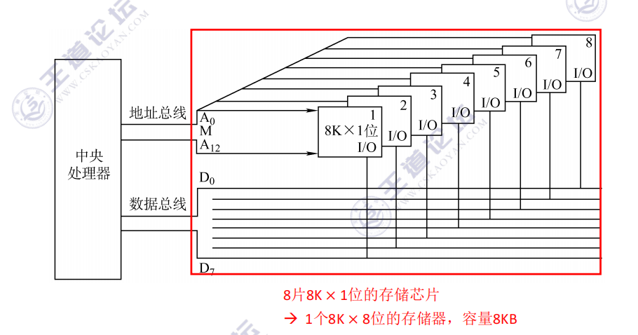
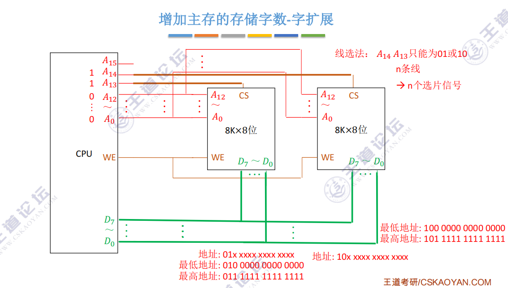
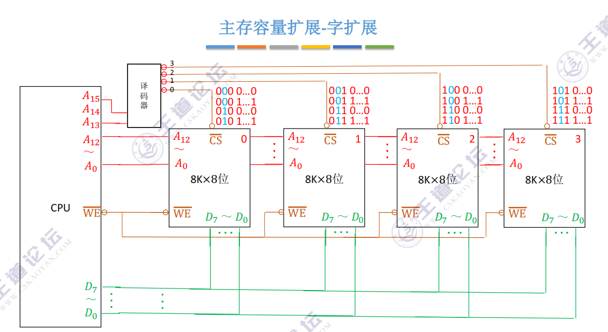
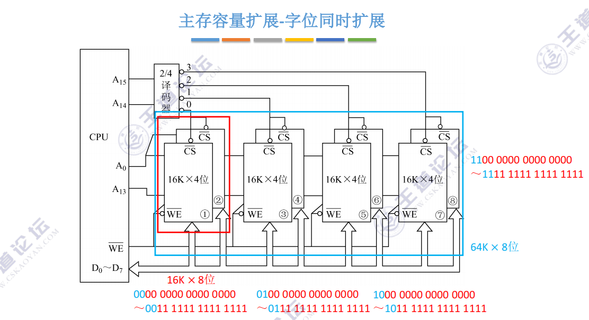

# 存储系统
## 存储器概述
### 存储器的分类
**按在计算机中的作用(层次)分类：**
- 主存储器
- 辅助存储器
- 高速缓冲存储器

**按存取方式分类：**
- 随机存取存储器(RAM)
- 相联存储器(CAM): 可以按内容访问的存储器
- 串行访问存储器：对存储单元进行读写操作时，需按物理先后顺序寻址，包括顺序存取存储器(如磁带)与直接存取存储器（如磁盘、光盘）

**信息的可修改性：**
- 读写存储器：磁盘、内存、Cache
- 只读存储器：CD-ROM、ROM、蓝光光碟

**按信息的可保存性分类：**
- 易失性存储器：如 RAM
- 非易失性存储器：如 ROM、磁表面存储器和光存储器

### 存储器性能指标
- 存储容量
- 单位成本
- 存储速度
    - 存取时间：启动一次存储器完成操作所经历事件
    - 存取周期：连续两次独立访问存储器之间所需最小时间间隔
    - 主存带宽：每秒从主存进出信息的最大数量

## 主存储器

### 主存储器的简单模型：

### SRAM 芯片和 DRAM 芯片
**SRAM 工作原理**
双稳态触发器(六晶体管 MOS)，存取速度快，但集成度低，功耗较大，价格昂贵，一般用于高速缓冲器

**DRAM 工作原理**
DRAM 利用存储元电路中栅极电容上的电荷来存储信息，DRAM 具有容易集成、位价低、容量大和功耗低等优点，但 DRAM 存取速度比 SRAM 慢，一般用于主存系统。  
  
DRAM 需要每隔一定时间进行刷新，常见刷新方式有 3 种：
- 集中刷新
- 分散刷新
- 异步刷新

**DRAM 地址线复用技术：** 行、列地址分两次送，可使地址线更少，芯片引脚更少(地址线减少为原来一半)。

注： 
- DRAM 刷新只需要一个存储周期
- 只有 DRAM 可以地址线复用，SRAM 不行

**DRAM 读写周期**  

  

## 只读存储器 ROM 
### 各种 ROM
- MROM（掩模式只读存储器）: 出厂时只写一次，之后只读不可写
- PROM（可编程只读存储器）：写一次不可更改
- EPROM（可擦除可编程只读存储器）：可进行多次重写
- EEPROM
- UVEPROM：紫外线照射擦除所有信息
- Flash（闪存）：断点后保存信息，且可进行多次擦除重写
- SSD（固态硬盘）：与闪存区别在于核心部件不同，也可进行多次擦除重写

主板上 BIOS 芯片即由 ROM 构成，用于负责引导操作系统。在逻辑上，RAM 和 ROM 构成主存且统一编址。

## 主存储器与 CPU 的链接
### 单存储器芯片与 CPU 连接
略  
  
### 多存储器芯片与 CPU 连接
#### 增加主存存储位长
- 位扩展    
  

- 字扩展
    - 线选法：n 条线决定 n 个选片信号

  

    - 译码片选法：n 条线决定 $2^n$ 个选片信号

- 字位同时扩展

## 双端口 RAM与多模块存储器
### 双端口 RAM 
用于优化多核 CPU 访问一根内存条的速度

### 多体并行存储器
- 高位交叉编址
- 低位交叉编址：可以流水化取数据，为了保证流水不间断，模块数 m >= T/r

## Cache
Cache 基本上已经比较熟了，这里只做一些总结或者记一些我不太熟的东西  
  
### 映射规则
- 直接映射
- 组相联映射
- 全相联映射

### 替换算法
- RAND(随机算法)
- FIFO(先进先出算法)
- LRU(近期最少使用)
- LFU(最近不经常使用)：为每个 Cache 块设置一个计数器，用于记录每个 Cache 被访问了几次，当 Cache 满后替换计数器最小的

### Cache 写策略
- 写命中
    - 全写法(写直通法)
    - 写回法
- 写不命中
    - 写分配法
    - 非写分配法

## 页式存储器
其实就是操作系统那套虚拟地址转物理地址的过程

## 虚拟存储器
- 段式存储器: 段首址 + 段内地址
- 段页式虚拟存储器：虚拟地址 = 段号 + 段内页号 + 段内地址
